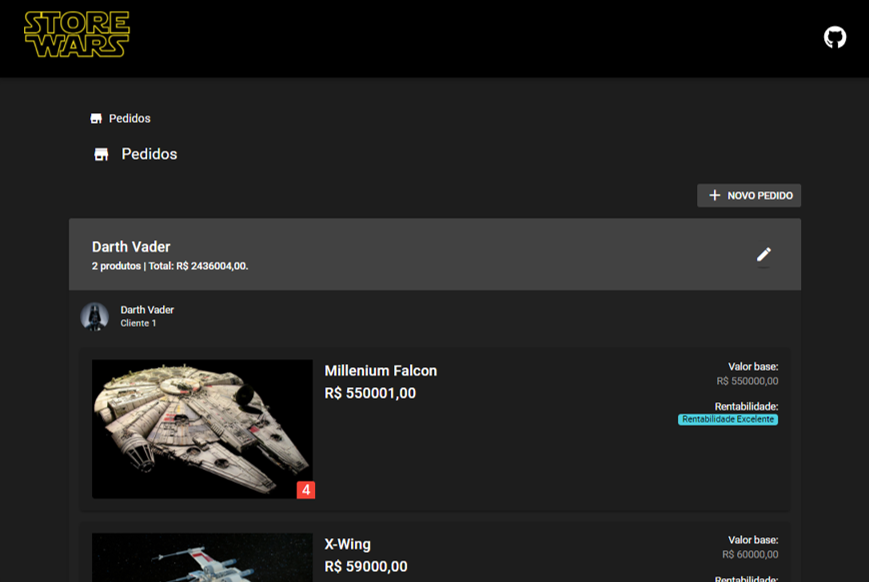

# Store Wars
A software to manage Star Wars products budget.



## API

A API encontra-se no repositório [Star Wars API](https://github.com/ewerton94/store_wars_api)

## Rodando o projeto localmente

1. Install dependences 
```
cd StoreWars # Move to project directory
npm install # Install dependences
```
2. Vá no arquivo `StoreWars/src/boot/axios` linhas 3 e 4 e ative a url de Localhost:

```javascript
const baseURL = 'http://localhost:8000/'
// const baseURL = 'https://ewerton94.pythonanywhere.com/'
```


3. Teste a Aplicação:

```
quasar test --unit jest
```

4. Rode a aplicação:

```
quasar dev
```

### Lint the files
```bash
npm run lint
```

### Build the app for production
```bash
quasar build
```

### Customize the configuration
See [Configuring quasar.conf.js](https://quasar.dev/quasar-cli/quasar-conf-js).
